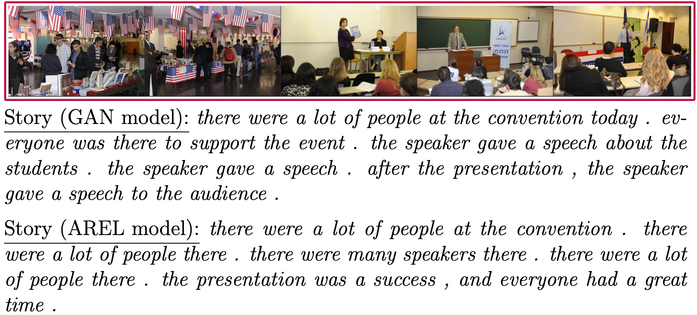
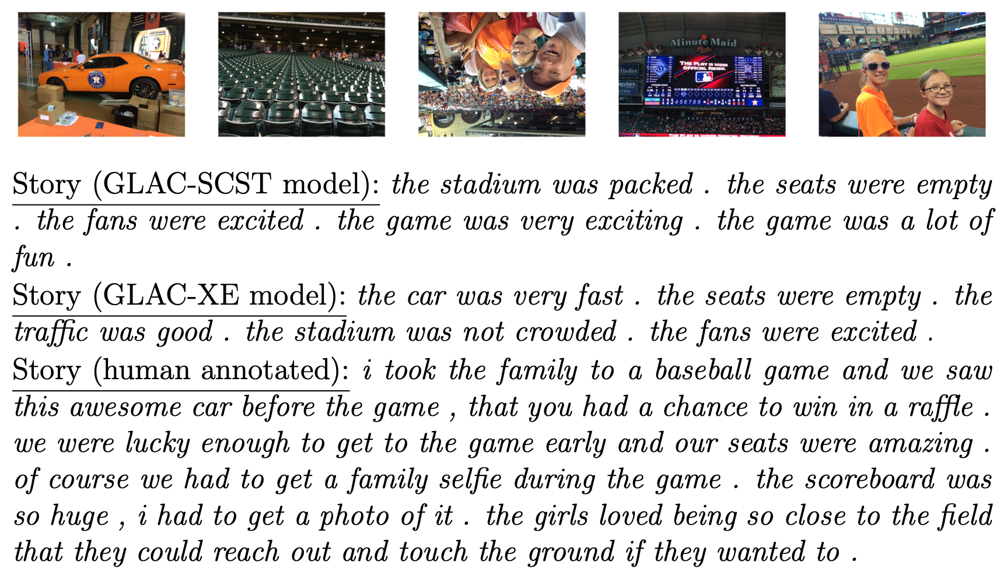

# Visual storytelling
___

In the space of automated captioning, the task of visual storytelling is one dimension. Given sequences of images as inputs, visual storytelling (VIST) is about automatically generating textual narratives as outputs.

This repository borrows heavily from [Aalto CBIR DeepCaption](https://github.com/aalto-cbir/DeepCaption) codebase.

## Requirements
___

- Python 3+, Python 2.7 (for arel submodule utilizing NLP metrics)
- PyTorch (v1.0+), torchvision 0.2.0+
- nltk
- gensim
- scipy, numpy
- pickle

## Models
___

The following models are implemented:

1. Baseline model - https://arxiv.org/abs/1604.03968
2. Multi decoder model - https://arxiv.org/abs/1806.00738
3. GLAC model - https://arxiv.org/abs/1805.10973 (also under self-critical sequence training ([SCST](https://arxiv.org/abs/1612.00563)) objective)
4. AREL & GAN models - https://arxiv.org/abs/1804.09160
5. Character-centric storytelling model - https://arxiv.org/abs/1909.07863

## Usage
___
This repository has the following structure:
```
resources
├── characters_analysis
├── configs
├── filtered_test
├── filtered_train
├── filtered_val
├── memad
├── models
├── plots
├── results
└── sis

sources
├── data
├── general
├── infer
├── models
├── scripts
└── train_validate

arel
├──

```
with `resources/filtered_[train/val/test]` holding the images of the sequences and `resources/sis` containing the respective annotations files of the [VIST dataset](http://visionandlanguage.net/VIST/dataset.html).

1. Models available for training are as follows:

```python
python3 sources/train_validate/baseline.py [--options]
python3 sources/train_validate/multi_decoder.py [--options]
python3 sources/train_validate/glac.py [--options]
python3 sources/train_validate/glac_sc.py [--options]
python3 sources/train_validate/baseline_cc.py [--options]
python2 arel/train_AREL.py [--options]
python2 arel/train_GAN.py [--options]
```
2. Trained checkpoints saved under `resources/models/` can be used for performing inference and evaluation as follows:

```python
python3 sources/infer/baseline.py [--options]
python3 sources/infer/multi_decoder.py [--options]
python3 sources/infer/glac.py [--options]
python3 sources/infer/baseline_cc.py [--options]
python2 arel/train_AREL.py --test [--options]
python2 arel/train_GAN.py --test [--options]
```
with `[--options]` being a collection of train/test phase model parameters and tunable hyperparameters which are documented in detail in the respective `.py` files.

## Sample results
___


